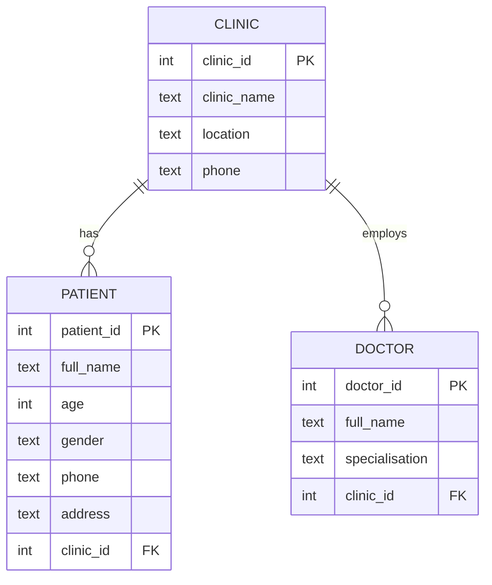

```mermaid
erDiagram
    CLINIC ||--o{ PATIENT : has
    CLINIC ||--o{ DOCTOR : employs

    CLINIC {
        int clinic_id PK
        text clinic_name
        text location
        text phone
    }

    PATIENT {
        int patient_id PK
        text full_name
        int age
        text gender
        text phone
        text address
        int clinic_id FK
    }

    DOCTOR {
        int doctor_id PK
        text full_name
        text specialisation
        int clinic_id FK
    }
```
